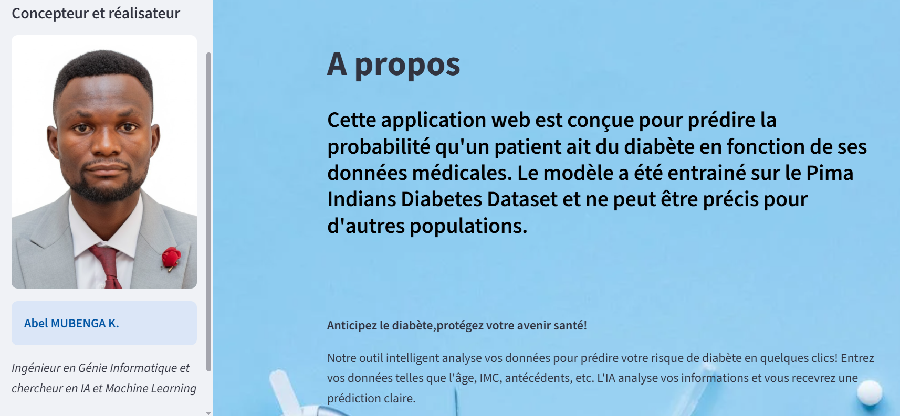
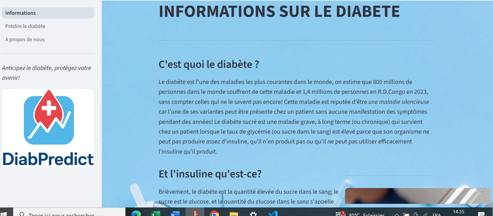

### DIAGNOSTIC DU DIABETE BASE SUR LE RANDOM FOREST
## 📌 Description
Ce projet implémente un système de prédiction du diabète basé sur l'apprentissage supervisé, en utilisant l'algorithme du RF sur le dataset Pima. Il permet de détecter les patients susceptibles de développer un diabète à partir des données médicaux.

## 🧪 Objectifs

- Appliquer des algorithmes de machine learning pour la classification.
- Comparer les performances de Random Forest avec d'autres modèles.
- Optimiser la précision à l'aide de la recherche par grille (GridSearchCV)
- Déployer le modèle dans une application web streamlit 

## 📂 Structure du projet

├── data/                  # Fichiers de données (CSV, etc.)
├── notebooks/             # Notebooks Jupyter
├── src/                   # Code source Python
│   ├── preprocessing.py
│   ├── model.py
│   └── evaluation.py
├── requirements.txt       # Dépendances du projet
├── README.md              # Ce fichier
└── main.py                # Point d’entrée principal

## 🧠 Modèles utilisés

- Random Forest Classifier
- Logistic Regression
- K-Nearest Neighbors (KNN)
- Decision Tree Classifier

## 📈 Évaluation

Les métriques utilisées pour évaluer les performances :
- Accuracy (exactitude)
- Precision
- Recall
- F1-Score
- Matrice de confusion

## Nota: Le notebook se trouve dans le dossier ML

## 🔍 Dataset

Le dataset utilisé est : *PIMA Indians Diabetes Dataset*, disponible sur [Kaggle](https://www.kaggle.com/datasets/uciml/pima-indians-diabetes-database).

## 📚 Bibliothèques

- `scikit-learn`
- `pandas`
- `numpy`
- `matplotlib`
- `seaborn`
- `streamlit`
## Interface utilisateur

## 👨‍💻 Auteur

- Nom Prénom — [Abel M.](https://github.com/Therighteous2)

